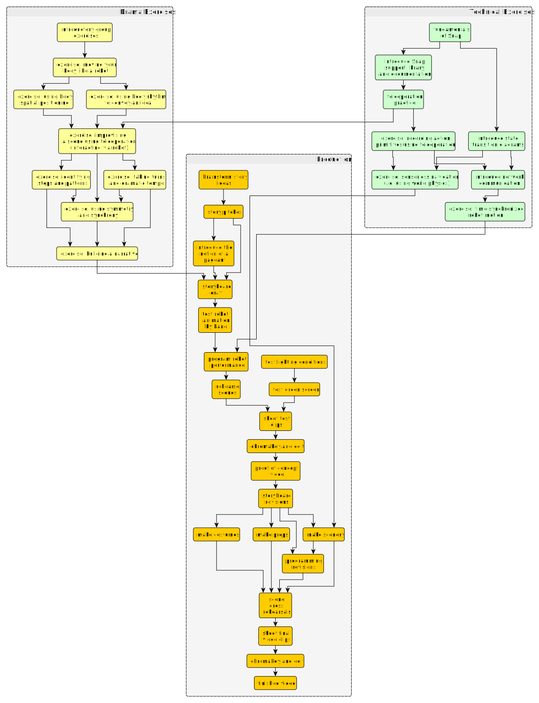

.. include:: links.rst

Introduction
************

This text is the companion guide to a curriculum for creating performances with
robots.  It is written to be accessible to middle-school students, but could be
used at a variety of levels.

The essential skill is to understand the meaning of movement, action, and form
in context well enough to convey a performance idea via a machine.
Accomplishing this using a robot requires finding insight into performance by
robot proxy as well as learning analytic and programming skills.

The text is written for the `Finch Robot`_ platform sold by `BirdBrain
Technologies`_, and uses the `Snap!`_ visual programming system.  However, the
core ideas are general and this course could be ported to other languages and
robots.

Prerequisites
=============

The text assumes that students are already familiar with the basic use of
`Snap!`_.  Students already familiar with `Scratch`_ may need to study a few of
the additional features provided by Snap.

The exercises assume students are already familiar with these basic programming
ideas in Snap:

#. imperative programming as sequences of commands
#. data representation as numbers and strings (atoms)
#. the idea of composite data representation as lists
#. creating functions with arguments
#. state machine transition diagrams and implementation

And these topics related to robotics:

#. issuing robot commands to change physical state (wheel velocity, LED color)
#. controlling timing of actions using delays
#. sampling robot sensors to estimate physical state (proximity sensors,
   accelerometer)

Learning Goals
==============

The following topics include the essential learning goals related to robot performance:

#. capturing human performance via robot
#. improvising with robots
#. formulating an interaction (pas de deux or dialogue)
#. the role of rhythm
#. ensemble choreography
#. creating meaning through context: story, setting, costuming
#. writing a script for video-recorded performance

Accomplishing these objectives will require learning more fundamentals
of robotics including the following:

#. using data to represent actions and trajectories
#. using a distributed protocol (networked key-value store)
#. creating primitives for sensorless navigation
#. designing environmental features for navigational assistance

Implementing these ideas will require new programming skills including the
following:

#. state machine graph representations
#. using lists as structured data: arrays, association lists
#. essential functional programming: values, iteration, and mapping
#. understanding recursive functions

Daily Sessions
==============

The course involves a series of hour-long sessions mixing technical exercises to
build robot skills and drama exercises to develop storytelling abilities.  In
general, the course will loosely alternate between technical and drama topics.
The specific sequence is flexible although a suggested sequence is diagrammed
below.

The culminating project is framed as a production of a video pageant.  The
choice of video is intended to increase the flexibility of the outcome, since it
eases incremental composition of a performance, reduces the demands of
performing live, and simplifies the staging.  However, the sequence could be
easily adapted to culminate in a live performance, either improvised or
rehearsed.

====	========================================================
Week	Activities
====	========================================================
1	| body movement exercises
	| review of fundamentals of Snap programming
	| pair and ensemble movement exercises
2	| introduction to Snap library, teleoperation and animation practice
	| sensorless navigation; synchronized movement
	| narrative movement exercises
3	| story brainstorming and pitching
	| scene storyboarding
	| development of robot motion using human rehearsal
4	| programming robots for performance
	| scene rehearsals
	| clip recording for proof-of-concept video
5	| costume, prop and scenery development
	| programming revisions
	| scene dress rehearsals
6	| clip recording for proof-of-concept video
	| final editing
	| final show, including live performance demonstrations
====	========================================================

Course Map
-----------

The following map illustrates the suggested paths through the exercises and
activities.  The **Production** phase outlines the process of developing a story
into a video performance.  Not every activity has a corresponding written
exercise, many of these are left to the discretion of the instructor.

